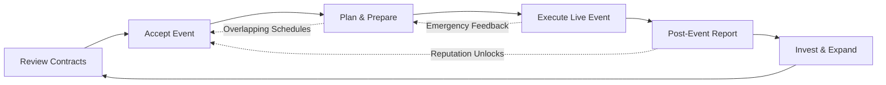

# Sector Pro Simulator – Core Gameplay Loop

The moment-to-moment experience of Sector Pro Simulator follows a cyclical structure that scales in difficulty as players take on larger productions. The diagram and breakdown below illustrate the repeatable loop and how individual systems feed into one another.

## Loop Stages
1. **Review Contracts** – Examine incoming offers, compare requirements against crew availability and financial goals, and decide which opportunities to pursue.
2. **Accept Event** – Commit to the gig, tour, or festival. Contract terms establish success criteria, penalties, and payout schedules.
3. **Plan & Prepare** – Assign crew, reserve equipment, map logistics, and build contingency plans. Multiple events may be in this phase simultaneously, forcing prioritization.
4. **Execute Live Event** – Transition to the real-time venue view. Monitor alerts, deploy teams, and resolve crises while staying on schedule and within budget.
5. **Post-Event Report** – Review performance metrics, client satisfaction, financial outcomes, and crew experience gains. Damage reports and fatigue levels feed forward into planning.
6. **Invest & Expand** – Allocate profits to new hires, gear, training, or upgrades. Reputation gains unlock higher-tier contracts and more challenging events, restarting the loop with expanded scope.

## Layered Complexity
- **Parallel Loops:** Advanced play introduces overlapping events at different stages of the loop, creating a multitasking challenge akin to managing a real production calendar.
- **Dynamic Events:** Random crises during stages three and four inject variability and test contingency planning.
- **Long-Term Progression:** Decisions made during investment influence the viability of future contracts, ensuring that each loop iteration feels connected to broader company growth.
